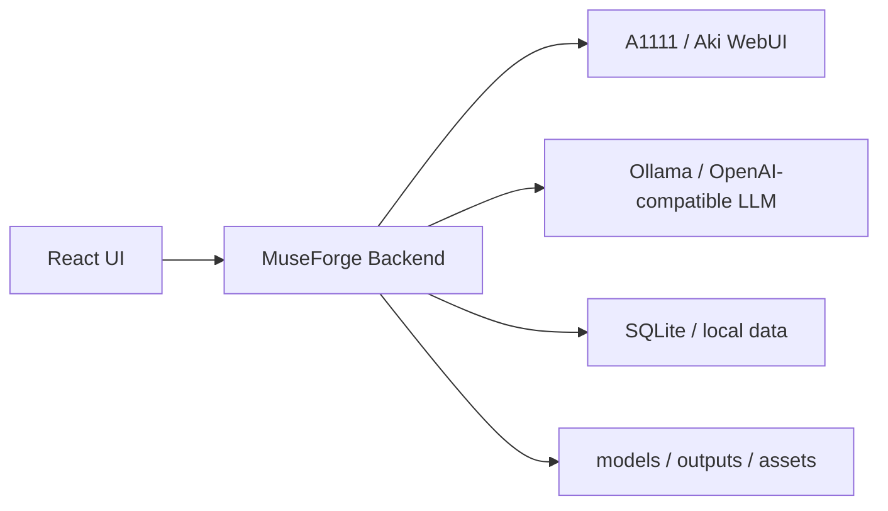
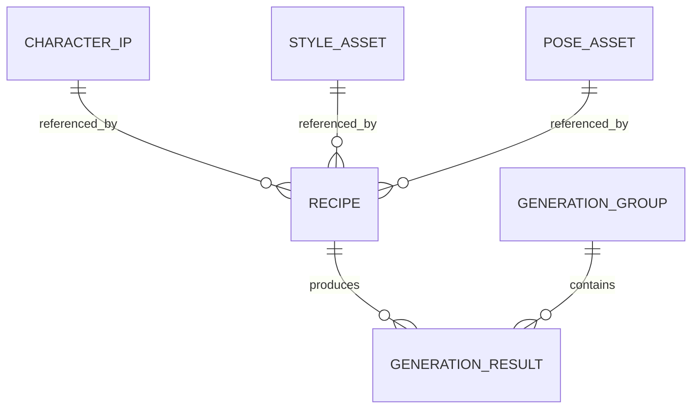

# MuseForge Studio 架构说明

## 1. 总体架构

MuseForge Studio 当前是一个轻量 monorepo：

```text
apps/
  backend/          Node HTTP API，负责资源读取、任务队列、A1111 调用和本地配置
  ui-prototype/     React/Vite 前端原型
packages/
  shared/           共享 schema、默认值和归一化逻辑
  model-providers/  LLM Provider 适配层
docs/               产品、架构、API 和引擎部署文档
scripts/            本地开发、A1111、Ollama 和检查脚本
```

实际 SD 模型、LoRA、VAE、ControlNet 权重、A1111 源码和用户输出不进入仓库。

## 2. 运行时组件



当前默认端口：

- UI：`http://127.0.0.1:5177`
- Backend：`http://127.0.0.1:8787`
- A1111：`http://127.0.0.1:7860`
- Ollama：`http://127.0.0.1:11434`

## 3. 前端职责

前端负责提供两个核心模式：

- 生图 Agent：自然语言输入、tag 辅助、方案确认、单次生成。
- 工作台：后续围绕 Recipe、批量抽卡、筛图、对比和资产引用展开。

当前 UI 仍是原型，不应把复杂推理过程作为主体验。现阶段应展示简单清楚的流程：

```text
输入需求 -> 生成 tag/参数方案 -> 用户确认 -> A1111 单次 txt2img -> 查看结果
```

## 4. 后端职责

`apps/backend` 是本地编排服务，不直接加载模型权重。

当前职责：

- 提供健康检查和运行时设置。
- 管理 Provider 配置和密钥。
- 调用 LLM 生成 tag 生图方案。
- 搜索 prompt-all-in-one 标签。
- 扫描本地 checkpoint、LoRA、VAE、ControlNet、sampler。
- 维护资源 profile 和用途标记。
- 校验生成计划中的资源兼容性。
- 创建、取消、重试和查询生成任务。
- 调用 A1111 txt2img。
- 保存生成结果和元数据。
- 管理 Ollama、本地模型拉取和低性能模式。
- 提供 LoRA 项目与训练任务雏形。
- 提供 ControlNet 资源导入与 preset 雏形。

后端不负责：

- 训练模型本身。
- 修改 WebUI 核心源码。
- 自动绕过用户确认提交复杂多轮生成。
- 对用户 prompt 做内容审查或净化。

## 5. Provider 层

`packages/model-providers` 当前用于创作助手 Provider：

- `mock`
- `openai`
- `openai-compatible`
- `local`
- `anthropic`

当前主要输出是 `GenerationPlan`。近期不再默认使用复杂 Function Call Agent，而是保留轻量 tag planning 能力。

后续 Provider 需要分为两类：

- Assistant Provider：理解需求、生成 prompt、清洗 caption、规划试验矩阵。
- Engine Provider：本地 A1111、ComfyUI、云端图像 API、云端视频 API。

## 6. 生成链路

当前稳定链路：

```text
POST /api/generate/plan
  -> 搜索 prompt tags
  -> LLM 生成 GenerationPlan
  -> normalizeGenerationPlan
  -> validateGenerationPlanResources

POST /api/tasks/generate
  -> preparePlanForGeneration
  -> A1111 /sdapi/v1/txt2img
  -> 保存图片和 generation 记录
```

重要约束：

- 默认单次 txt2img。
- 默认不启用 Hires Fix。
- 默认不启用 Extras upscale。
- 默认不启用 ADetailer。
- 默认不做视觉评分。
- LoRA 没有 trigger words 时只加载 LoRA，不编造触发词。

这些约束来自近期画质调试结论：复杂后处理在当前环境中更容易造成模糊、彩噪或插件兼容问题。

## 7. 数据与资产

当前已有本地 SQLite 和输出目录。下一阶段需要把以下对象正式落库：

- Recipe
- RecipeSnapshot
- GenerationGroup
- CharacterIP
- StyleAsset
- PoseAsset

推荐关系：



## 8. 下一阶段架构重点

P1 应优先建设 Recipe 和批量任务：

- 在 shared 包中定义 Recipe schema。
- 在后端新增 Recipe CRUD。
- 任务创建支持 group 和 seed 策略。
- generation 记录保存 recipe 快照。
- UI 工作台围绕 Recipe 展开，而不是围绕一次聊天展开。
